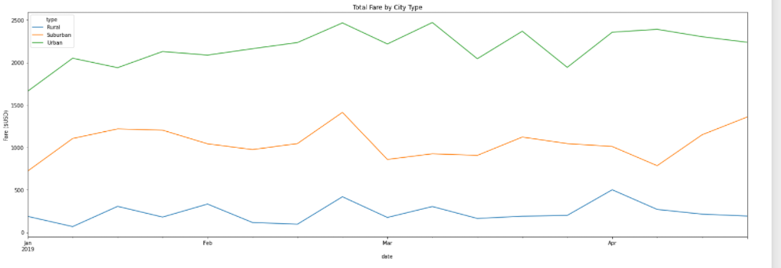

# PyBer_Analysis

### Overview of the analysis:
Using my Python skills and knowledge of Pandas, I’ll create a summary DataFrame of the ride-sharing data by city type. Then, using Pandas and Matplotlib, I’ll create a multiple-line graph that shows the total weekly fares for each city type.

### Results: Ride-sharing data among the different city types.
Summary below: 

Highest:
* Total Rides - Urban
* Total Drivers - Urban
* Total Fares - Urban
* Average Fare per Ride - Rural
* Average Fare per Driver - Rural

Lowest:
* Total Rides - Rural
* Total Drivers - Rural
* Total Fares - Rural
* Average Fare per Ride - Urban
* Average Fare per Driver - Urban

Dataframe Summary:

Line Graph Summary:

### Three business recommendations to the CEO for addressing any disparities among the city types:
1. Add more data to your database. The more data - the better the discrepancies we can see between the types.
2. Obviously there should and are more drivers in the denser part of the population (urban). Maybe PyBer can intiate surge charging like Uber, in order to increase the averages fares.
3. Maybe help incentivces drivers in the suburban region - since the average far to the driver is much higher than urban, so if it were to increase popularity in the suburban locations it would be beneficial to the company since this is a nice middle group of fares for the driver and riders.
